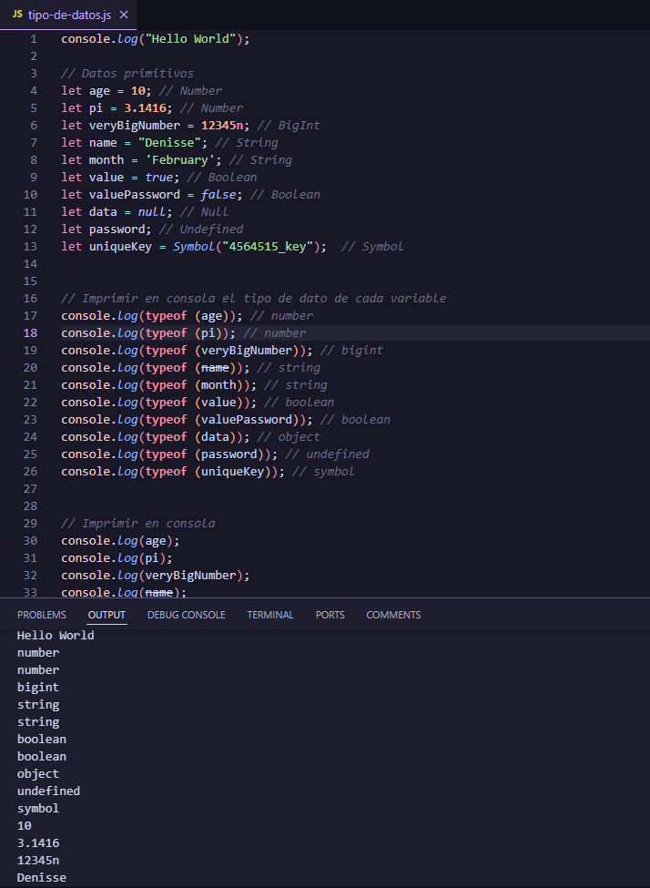
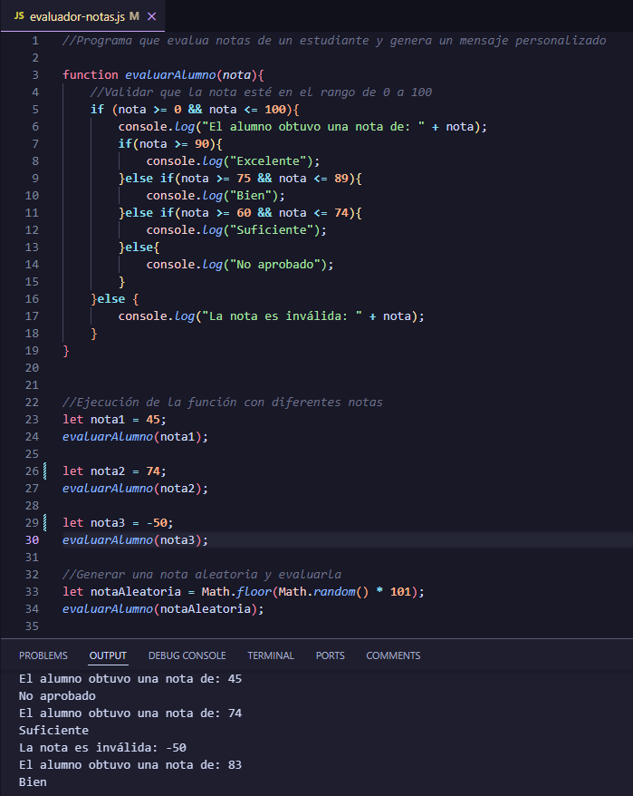
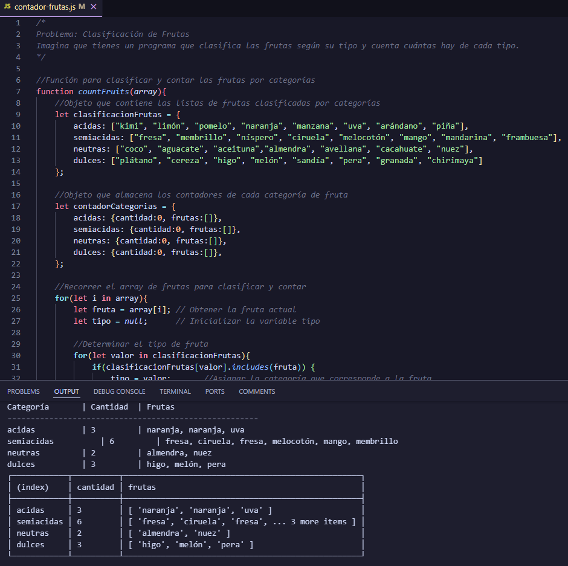

# Módulo 3: Javascript

**JavaScript** es el lenguaje de programación que hace que las páginas web sean interactivas. Desde efectos visuales y animaciones hasta la gestión de datos y la interacción con el usuario, JavaScript es el motor que impulsa la web moderna.

## Contenido del Módulo

### Clase 01 - Introducción a JS

  
Datos primitivos

   Son los tipos de datos más simples y directos que existen en el lenguaje.

  *   **Números:** Representan números, tanto enteros como decimales.
  *   **Cadenas (Strings):** Representan texto.
  *   **Booleanos (Booleans):** Representan valores lógicos: `true` (verdadero) o `false` (falso). Se utilizan para tomar decisiones en el código.
  *   **Null:** Es un valor asignado explícitamente a una variable para indicar que no tiene un valor.
  *   **Undefined:** Representa una variable a la que no se le ha asignado un valor.
  *   **BigInt:** Se utiliza para representar números enteros muy grandes.
  *   **Symbol:** Se utiliza para crear identificadores únicos.

  [Enlace al código](https://github.com/yuleiditho/Modulo-03-JS/blob/main/01-%20Intro%20JS/tipo-de-datos.js) 

  
  

### Clase 02 - Comparaciones y Decisiones

  
Evaluador de Notas con Mensajes Personalizados

    Crear un programa en JavaScript que evalúe la nota de un estudiante y genere un mensaje personalizado basado en la nota.

  **Objetivos:**

  *   Declaración de variables.
  *   Uso de condicionales `if`, `else if` y `else`.
  *   Uso de operadores de comparación (`<`, `>`, `<=`, `>=`) para determinar el rango de la nota.
  *   Impresión de mensajes personalizados en la consola.

  [Enlace al código](https://github.com/yuleiditho/Modulo-03-JS/blob/main/02-Comp_Dec_JS/evaluador-notas.js) 

  

### Clase 03 - Ciclos y Arreglos

  
Problema: Clasificación de Frutas

    Crear un programa que clasifica las frutas según su tipo y cuenta cuántas hay de cada tipo.

  **Objetivos:**

  *   Practicar la lógica de control de flujo: `for` y `while`.
  *   Aprender a usar arreglos para almacenar datos.
  *   Utilizar objetos para contar y clasificar elementos.

  [Enlace al código](https://github.com/yuleiditho/Modulo-03-JS/blob/main/03-Arrays_Ciclos/contador-frutas.js) 

  

