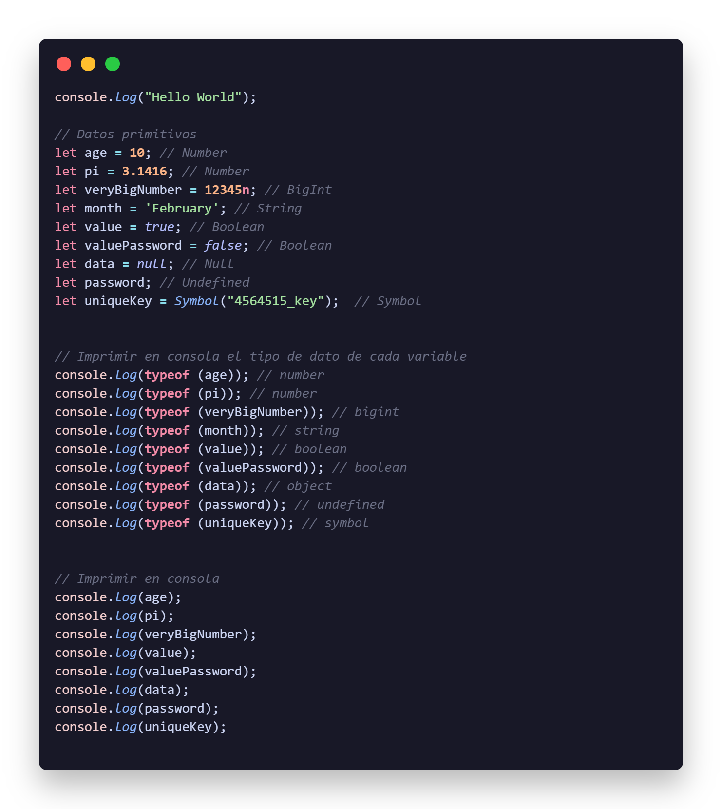

# Módulo 3: Javascript

**JavaScript** es el lenguaje de programación que hace que las páginas web sean interactivas. Desde efectos visuales y animaciones hasta la gestión de datos y la interacción con el usuario, JavaScript es el motor que impulsa la web moderna.

## Clases
| # | Clase | Descripción | Código | Resultado |
|---|---|---|---|---|
| 1 | **Datos primitivos** [Intro JS](https://github.com/yuleiditho/Modulo-03-JS/tree/main/01-%20Intro%20JS) | Son los tipos de datos más simples y directos que existen en el lenguaje.   - **Números:** Representa números, tanto enteros como decimales.   - **Strings:** Representa cadenas de texto.   - **Booleans:** Representa valores lógicos: `true` (verdadero) o `false` (falso). Se utilizan para tomar decisiones en el código.   - **Null:** Es un valor asignado explícitamente a una variable para indicar que no tiene un valor.   - **Undefined:** Representa una variable a la que no se le ha asignado un valor.   - **BigInt:** Se utiliza para representar números enteros muy grandes.   - **Symbol:** Se utiliza para crear identificadores únicos. |  |  |

